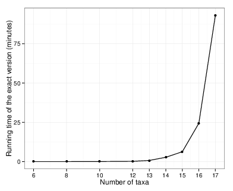

-------------------------
DESCRIPTION:
---------------
ASTRAL is a java program for estimating a species tree given a set of unrooted gene trees. ASTRAL is statistically consistent under multi-species coalescent model (and thus is useful for handling ILS). The optimization problem solved by ASTRAL seeks to find the tree that maximizes the number of induced quartet trees in gene trees that are shared by the species tree. The optimization problem is solved exactly for a constrained version of the problem that restricts the search space. An exact solution to the unconstrained version is also implemented and can run on small datasets (less than 18 taxa).

The original ASTRAL algorithm is described in:

* Mirarab, Siavash, Rezwana Reaz, Md. Shamsuzzoha Bayzid, Theo Zimmermann, M Shel Swenson, and Tandy Warnow. “ASTRAL: Genome-Scale Coalescent-Based Species Tree.” Bioinformatics 30, no. 17 (2014): i541–i548. [doi:10.1093/bioinformatics/btu462](doi.org/10.1093/bioinformatics/btu462).

The current version of the ASTRAL code corresponds to the algorithm called ASTRAL-II and is described in:

* Mirarab, Siavash, Tandy Warnow. “ASTRAL-II: Coalescent-Based Species Tree Estimation with Many Hundreds of Taxa and Thousands of Genes.”. Bioinformatics (ISMB special issue) 31, no. 12 (2015): i44–i52. [doi:10.1093/bioinformatics/btv234](http://bioinformatics.oxfordjournals.org/content/31/12/i44)

Since version 4.10.0, ASTRAL can also compute branch length (in coalescent units) and a measure of support called “local posterior probability”, described here:

* Sayyari Erfan, Mirarab Siavash. Fast coalescent-based computation of local branch support from quartet frequencies.  Molecular Biology and Evolution (2016). [doi:10.1093/molbev/msw079](http://mbe.oxfordjournals.org/content/early/2016/05/12/molbev.msw079.short?rss=1)


For more details, refer to the chapter 5 of Siavash's [dissertation](https://repositories.lib.utexas.edu/bitstream/handle/2152/31377/MIRARABBAYGI-DISSERTATION-2015.pdf).


Email: `astral-users@googlegroups.com` for questions. Please subscribe to the mailing list for infrequent updates. 


---------------
Tutorial Steps:
---------------

### INSTALLATION:

There is no installation required to run ASTRAL. You simply need to download the [zip file](https://github.com/smirarab/ASTRAL/raw/master/Astral.4.10.6.zip) and extract the contents to a folder of your choice. Alternatively, you can clone the [GitHub repository](https://github.com/smirarab/ASTRAL/) if you are familiar with git. If you clone the git repository, you can run `make.sh` to build the project, or simply use the jar file that is included with the repository. 

ASTRAL is a java-based application, and should run in any environment (Windows, Linux, Mac, etc.) as long as java is installed. java 1.5 or later is required. We have tested ASTRAL only on Linux and MAC, but it should work on Windows too.

In the remaining of the tutorial, we will assume you have extracted the ASTRAL zip file into a directory with the path `~/astral-home/`. In the commands given below, substitute `~/astral-home/` with the directory you have chosen for ASTRAL. 


###  Running ASTRAL from command-line to see the help:

ASTRAL currently has no GUI. You need to run it through command-line. Open a terminal (on Windows, look for a program called `Command Prompt` and run that; on Linux you should know how to do this; on MAC, search for an application called `Terminal`). Once the terminal opens, go the location where you have downloaded the software (e.g. using `cd ~/astral-home/`), and issue the following command:

```
  java -jar astral.5.5.1.jar
```

This will print the list of options available in ASTRAL. If no errors are printed, your ASTRAL installation is fine and you can proceed to the next sections. 

###  Running ASTRAL on a sample input dataset 

We will next run ASTRAL on an input dataset. From the ASTRAL directory, run:

```
java -jar astral.5.5.1.jar -i test_data/song_mammals.424.gene.tre
```

The results will be outputted to the standard output. To save the results in an output file use the `-o` option:

```
java -jar astral.5.5.1.jar -i test_data/song_mammals.424.gene.tre -o test_data/song_mammals.tre
```

Here, the main input is just a file that contains all the input gene trees in Newick format. The input gene trees are treated as unrooted, whether or not they have a root. Note that the **output of ASTRAL should also be treated as an unrooted tree**. 

The test file that we are providing here is based on the [Song et. al.](http://www.pnas.org/content/109/37/14942.short) dataset of 37 mammalian species and 442 genes. We have removed 23 problematic genes (21 mislabeled genes and 2 genes we classified as outliers) and we have also re-estimated gene trees using RAxML on the alignments that authors of that paper kindly provided to us. 

The input gene trees can have polytomies (unresolved branches) since [version 4.6.0](CHANGELOG.md). However, be aware that the use of unresolved gene trees can increase the running time, especially
when the input gene trees have many high degree multifurcations. 


### Viewing results of ASTRAL:

The output of ASTRAL is a tree in Newick format. These trees can be viewed in many existing tools. Here are some that are used by many people:

1. [FigTree](http://tree.bio.ed.ac.uk/software/figtree/) is probably the most widely used tool. It produces nice looking figures and works under Linux, Windows, and MAC. 
2. [Archaeopteryx](https://sites.google.com/site/cmzmasek/home/software/archaeopteryx) is very good for viewing large trees and also works under all three operating systems. 
3. [EvolView](http://www.evolgenius.info/evolview): online application. You don't even need to download. 

There are [many more tools](http://en.wikipedia.org/wiki/List_of_phylogenetic_tree_visualization_software).

For this tutorial, let's use the online viewer (EvolView) or any other tool you can manage to download and install. Using either of these applications open the `test_data/song_mammals.tre` file. We will explore various tree viewing options. Importantly, we will reroot the tree at the correct node, which is always necessary, since the rooting of the ASTRAL trees is arbitrary and meaningless.  

#### Branch length and support

ASTRAL measures branch length in coalescent units and also has a fast way of measuring support without a need for bootstrapping. 
The algorithms to compute branch lengths and support and the meaning of support outputted is further described in [the paper mentioned above](http://mbe.oxfordjournals.org/content/early/2016/05/12/molbev.msw079.short?rss=1).
We will return to these in later sections. Some points have to be emphasized:

* ASTRAL only estimates branch lengths for internal branches and not terminal branches. 
* Branch lengths are in coalescent units and are a direct measure of the amount of discordance in the gene trees. As such, they are prone to underestimation because of statistical noise in gene tree estimation.   
* Branch support values measure the support for a quadripartition (the four clusters around a branch) and not the bipartition, as is commonly done. 


### The ASTRAL Log information

ASTRAL outputs lots of useful informations to your screen ([stderr](https://en.wikipedia.org/wiki/Standard_streams) really). You can capture these information
by directing your stderr to a file. Capturing the log is highly recommended. Here is how you would capture stderr:

```
java -jar astral.5.5.1.jar -i test_data/song_mammals.424.gene.tre -o test_data/song_mammals.tre 2> song_mammals.log
```

Here are some of the important information captured in the log:

* Number of taxa, and their names. Double check these to make sure they are correct
* Number of genes. 
* Version of ASTRAL used in your analysis
* The normalized quartet score (proportion of input gene tree quartet trees satisfied by the species tree). This is a number between zero and one; the higher this number, the *less* discordant your gene trees are. 
* The final optimization score is similar to the above number, but is not normalized (the number of gene tree quartets satisfied by the species tree)
* Running time
* More advanced logs show the size of the search space in terms of the number of clusters and number of tripartitions (i.e., elements weighted). Note that for challenging datasets (not this mammalian dataset) the search space grows using heuristics implemented in ASTARL. We will get back to this.  

### Running on larger datasets:
We will now run ASTRAL on a relatively large dataset. Run:

```
java -jar astral.5.5.1.jar -i test_data/100-simulated-boot
```

The input file here is a simulated dataset with 100 sequences and 100 replicates of bootstrapped gene trees for 25 loci (thus 2,500 input trees). Note that ASTRAL finishes on this dataset in a matter of seconds. 

A larger real dataset from the [1kp](http://www.pnas.org/content/early/2014/10/28/1323926111) dataset is also included. This dataset includes
424 genes from 103 species. Run:

```
java -jar astral.5.5.1.jar -i test_data/1KP-genetrees.tre -o test_data/1kp.tre
```

This takes about a minute to run on a powerful laptop. On this dataset, notice in the ASTRAL log information that it originally starts with 11043 clusters in its search space, and using heuristics implemented in ASTRAL-II, it increases the search space slightly to 11085 clusters. For more challenging datasets (i.e., more discordance or fewer genes) this number might increase a lot. 

Scoring a species tree
--------------
You can use the `-q` option in ASTRAL to score an existing species tree to produce its quartet score, compute its branch lengths, and compute its ASTRAL branch support values. The ASTRAL score is the fraction of the induced quartet trees in the input set that are in the species tree. So, a score of `0.9` would mean that 90% of the quartet trees induced by your gene trees are in your species tree. 

To score a tree using ASTRAL, run:

```
java -jar astral.5.5.1.jar -q test_data/simulated_14taxon.default.tre -i test_data/simulated_14taxon.gene.tre -o test_data/simulated_scored.tre
```

This will score the species tree given in `test_data/simulated_14taxon.default.tre` compared to the gene trees given in `test_data/simulated_14taxon.gene.tre`. It will output:

```
Quartet score is: 4803
Normalized quartet score is: 0.4798201798201798
```

This means 4803 induced quartet trees from the gene trees are in the species tree, and these 4803 quartets are 47.98% of all the quartet trees that could be found in the species tree. As mentioned before, this dataset is one with a *very high* ILS level. 

In addition to giving an overall score, when you score a tree, branch lengths
and branch support are also computed and outputted. In the next section, we will
introduce ways to output even more information per branch. 

When scoring a tree, you probably want to capture the stderr using `2>name_of_a_file` technique described before. 

Extensive branch annotations
---------------
Where you are inferring a species tree or scoring one using the `-q` option,
you will always get estimates of the branch length and local posterior support
for each branch. In addition to these default annotations for each branch, 
you can ask ASTRAL to output other per branch information. 

Around each branch in an unrooted tree, there are four groups. If you think about a rooted tree, the four groups defined by a branch are the first child (`L`), the second child (`R`), the sister group (`S`), and everything else (`O`). With these four groups, if keep all the groups intact, we can have three unrooted topologies: `RL|SO`, `RS|LO`, and `RO|LS`. The first topology is what the
current tree has, and we refer it to as the main topology. The two others
are alternative topologies, and we refer to `RS|LO` and `RO|LS` as the first and the second alternatives, respectively. ASTRAL can output not just the local posterior probability for the main tree, but also the two alternatives. 

To enable extra per branch information, you need to use the `-t` option. 
Here is a description of various information that can be turned on by using `-t`.


* *no annotations* (`-t 0`): If you hate our posteriors and cannot stand seeing them, you can use this option turn them off. If our calculations are causing numerical errors you can use this to at least get the topology.  
* *Quartet support* (`-t 1`): The local posterior probabilities are computed based on a transforation of the percentage of quartets in gene trees that agree or disagree with a branch. See Figure 2 of our MBE paper referenced above for the relationship. If you want to know what percentage of quartets in your gene trees agree with a branch, use this option. We refer to this measure as the quartet support.  Quartet score is a good way of measuring the amount of gene tree conflict around a branch.  
* *Alternative posteriors* (`-t 4`): When this option is used, ASTRAL outputs three local posterior probabilities: one for the main topology, and one for each of the two alternatives (`RS|LO` and `RO|LS`, in that order). The posterior of the three topologies adds up to one. This is because of our locality assumption, which basically asserts that we assume the four groups around the branch (`L`, `R`, `S`, and  `O`) are each correct and therefore, there are only three possible alternatives. 
* *Full annotation* (`-t 2`): When you use this option, for each branch you get a lot of different measurements:
   * `q1`,`q2`,`q3`: these three values show quartet support (as defined in the description of `-t 1`) for the main topology, the first alternative, and the second alternative, respectively. 
   * `f1`, `f2`, `f3`: these three values show the total number of quartet trees in all the gene trees that support the main topology, the first alternative, and the second alternative, respectively.
   * `pp1`, `pp2`, `pp3`: these three show the local posterior probabilities (as defined in the description of `-t 4`) for the main topology, the first alternative, and the second alternative, respectively.
   * `QC`: this shows the total number of quartets defined around each branch (this is what our paper calls `m`).
   * `EN`: this is the effective number of genes for the branch. If you don't have any missing data, this would be the number of branches in your tree. When there is missing data, some gene trees might have nothing to say about a branch. Thus, the effective number of genes might be smaller than the total number of genes. 
* *Alternative quartet topologies* (`-t 8`): Outputs `q1`, `q2`, `q3`; these three values show quartet support (as defined in the description of `-t 1`) for the main topology, the first alternative, and the second alternative, respectively.

Run:

```
java -jar astral.5.5.1.jar -q test_data/1kp.tre -i test_data/1KP-genetrees.tre -t 2 -o test_data/1kp-scored-t2.tre
```
```
java -jar astral.5.5.1.jar -q test_data/1kp.tre -i test_data/1KP-genetrees.tre -t 4 -o test_data/1kp-scored-t4.tre
```
```
java -jar astral.5.5.1.jar -q test_data/1kp.tre -i test_data/1KP-genetrees.tre -t 8 -o test_data/1kp-scored-t8.tre
```
read all the values given for a couple of branches and try to make sense of them. 


#### Prior hyper-parameter

Our calculations of the local posterior probabilities and branch lengths use a Yule prior model for the branch lengths of the species tree. The speciation rate (in coalescent units) of the Yule process (lambda) is by default set to 0.5, which results in a flat prior for the quartet frequencies in the `[1/3,1]` range. Using `-c` option one can adjust the hyper-parameter for the prior. For example, you might want to estimate lambda from the data after one run and plug the estimate prior in a subsequent run. We have not yet fully explored the impact of lambda on the posterior. For branch lengths, lambda acts as a pseudocount and can have a substantial impact on the estimated branch length for very long branches. More specifically, if there is no, or very little discordance around a branch, the MAP lengths of the branch (which is what we report) is almost fully determined by the prior. 

Run the following two commands and compare the lengths of the longest branches:

```
java -jar astral.5.5.1.jar -q test_data/1kp.tre -i test_data/1KP-genetrees.tre -c 2 -o test_data/1kp-scored-c2.tre
```

```
java -jar astral.5.5.1.jar -q test_data/1kp.tre -i test_data/1KP-genetrees.tre -c 0.001 -o test_data/1kp-scored-cs.tre
``` 

Note that setting lambda to 0 results in reporting ML estimates of the branch lengths instead of MAP. However, for branches with no discordance, we cannot compute a branch lengths. For these, we currently arbitrarily set ML to 10 coalescent units (we might change this in future versions).


### Multi-locus Bootstrapping:
Recent versions of ASTRAL output a branch support value even without bootstrapping. Our [analyses](http://mbe.oxfordjournals.org/content/early/2016/05/12/molbev.msw079.short?rss=1) have revealed that this form of support is more reliable than bootstrapping under conditions we have compared the two methods. Nevertheless, you may want to run bootstrapping as well. 

Astral can perform multi-locus bootstrapping ([Seo, 2008](http://www.ncbi.nlm.nih.gov/pubmed/18281270)). To be able to perform multi-locus bootstrapping, ASTRAL needs to have access to bootstrap replicates for each gene. To start multi-locus bootstrapping using ASTRAL, you need to provide the location of all gene tree bootstrap replicates. To run bootstrapping on our test input files, 

* go to `test_data` directory, and 
* decompress the file called `song_mammals.424genes.bs-trees.zip`. 
* Now run:

```
java -jar ../astral.5.5.1.jar -i song_mammals.424.gene.tre -b bs-files
```

This will run 100 replicates of bootstrapping. The argument after `-i` (here `song_mammals.424.gene.tre`) contains all the maximum likelihood gene trees (just like the case where bootstrapping was not used). The `-b` option tells ASTRAL that bootstrapping needs to be performed. Following `-b` is the name of a file (here `bs-files`) that contains the location of gene tree bootstrap files, one line per gene. For example, the first line is `424genes/100/raxmlboot.gtrgamma/RAxML_bootstrap.allbs`, which tells ASTRAL that the gene tree bootstrap replicates of the first gene can be found in a file called `424genes/100/raxmlboot.gtrgamma/RAxML_bootstrap.allbs`.

By default, ASTRAL performs 100 bootstrap replicates, but the `-r` option can be used to perform any number of replicates. For example, 

```
java -jar ../astral.5.5.1.jar -i song_mammals.424.gene.tre -b bs-files -r 150
```

will do 150 replicates. Note that your input gene tree bootstrap files need to have enough bootstrap replicates for the number of replicates requested using `-r`. For example, if you have `-r 150`, each file listed in `bs-files` should contain at least 150 bootstrap replicates.

**Gene+site resampling:** 
ASTRAL performs site-only resampling by default (see [Seo, 2008](http://www.ncbi.nlm.nih.gov/pubmed/18281270)). ASTRAL can also perform gene+site resampling, which can be activated with the `-g` option:

```
java -jar ../astral.5.5.1.jar -i song_mammals.424.gene.tre -b bs-files -g -r 100
```

Note that when you perform gene/site resampling, you need more gene tree replicates than the number of multi-locus bootstrapping replicates you requested using `-r`. For example, if you have `-g -r 100`, you might need 150 replicates for some genes (and less than 100 replicates for other genes). This is because when genes are resampled, some genes will be sampled more often than others by chance.

**Gene-only resampling:** 
ASTRAL can also perform gene-only bootstrapping using the `--gene-only` option. This form of bootstrapping requires only one input file, which is given using `-i`. Thus, for this, you don't need to use `-b`. The following performs bootstrapping by resampling genes in the input file:

```
java -jar ../astral.5.5.1.jar -i song_mammals.424.gene.tre --gene-only
```


Finally, since bootstrapping involves a random process, a seed number can be provided to ASTRAL to ensure reproducibility. The seed number can be set using the `-s` option (by default 692 is used). 

#### Output:
As ASTRAL performs bootstrapping, it outputs the bootstrapped ASTRAL tree for each replicate. So, if the number of replicates is set to 100, it first outputs 100 trees. Then, it outputs a greedy consensus of all the 100 bootstrapped trees (with support drawn on branches). Finally, it performs the main analysis (i.e. on trees provided using `-i` option) and draws branch support on this main tree using the bootstrap replicates. Therefore, in this example, the output file will include 102 trees. The most important tree is the tree outputted at the end; this is the ASTRAL tree on main input trees, with support values drawn based on bootstrap replicates. Support values are shown as branch length (i.e. after a colon sign) and are percentages (as opposed to local posterior probabilities that when present are shown as a number between 0 and 1). 


### The exact version of ASTRAL

ASTRAL has an exact and a heuristic version. The heuristic version solves the optimization problem exactly subject to the constraint that all the bipartitions in the species tree should be present in at least one of the input gene trees, or in a set of some other bipartitions that (since [version 4.5.1](CHANGELOG.md)) ASTRAL automatically infers from the set of input gene trees as likely bipartitions in the species tree. The constrained version of ASTRAL is the default. However, when you have a small number of taxa (typically 17 taxa or less), the exact version of ASTRAL can also run in reasonable time (see the figure below). 



Since the mammalian dataset we have used so far has 37 taxa, the exact version cannot run on it. However, we have created a subset of this dataset that has all 9 primates, tree shrew, rat, rabbit, horse, and the sloth (a total of 14 taxa). We can run the exact version of ASTRAL on this reduced dataset. Run:

```
java -jar astral.5.5.1.jar -i test_data/song_primates.424.gene.tre -o test_data/song_primates.424.exact.tre -x
```

Using the `-x` option results in running the exact version of the ASTRAL algorithm. This run should finish in about 30 seconds. Now, we will run ASTRAL on the same input using the default heuristic algorithm:

```
java -jar astral.5.5.1.jar -i test_data/song_primates.424.gene.tre -o test_data/song_primates.424.default.tre
```
This time, ASTRAL finished in under a second. So, is there a difference between the output of the exact and the heuristic version? Open up the two trees in your tree viewer tool and compare them. You will notice they are identical. You could also compare the scores outputted by ASTRAL and notice that they are identical. 


###  Example where exact helps


The default primate dataset we used in the previous step had 424 genes and 14 taxa. Since we have a relatively large number of gene trees, we could reasonably expect the exact and heuristic versions to generate identical output. The key point here is that as the number of genes increases, the probability that each bipartition of the species tree appears in at least one input gene tree increases. Thus, with 424 genes all bipartitions from the species tree are in at least one input gene tree, and therefore, the exact and the heuristic versions are identical. 

We tried hard to find a subset of genes in the biological primates dataset where the exact and the heuristic versions did not match. We couldn't! So we had to resort to simulations. We simulated a 14-taxon dataset with extreme levels of ILS (average 87% RF between gene trees and the species tree). Now, with this simulated dataset, if you take only 10 genes, something interesting happens.


Run

```
java -jar astral.5.5.1.jar -i test_data/simulated_14taxon.gene.tre -o test_data/simulated_14taxon.default.tre
```

and then

```
java -jar astral.5.5.1.jar -i test_data/simulated_14taxon.gene.tre -o test_data/simulated_14taxon.exact.tre -x
```

Now you see that the tree outputted by the exact version has a slightly higher score (4812=48.07% versus 4803=47.98%), and a slightly different topology compared to the heuristic version. Thus, in extreme cases (i.e. lots of ILS and/or gene tree estimation error and few available gene trees compared to the number of taxa), one could observe differences between the exact and heuristic versions. Note that how many genes should be considered few depends on the number of taxa you have, and also how much missing data there is. 

The main point of our ASTRAL-II work is to make  the heuristic version as close to the exact version as possible. We have tested the heuristic version and a condition similar to the exact condition in our ASTRAL-II paper and have observed no real differences. Thus, we believe the ASTRAL-II heuristics do a very good job of searching the tree space. But when the exact version can be run, there is no reason not to. 


### Step 7: Providing ASTRAL with extra trees:


We always have another option for increasing the search space. Imagine that you are able to create a set of hypothetical trees using various methods. For example, maybe you have a prior hypothesis of what the species tree could be. Or, maybe you have run concatenation and have potential species trees. Most realistically, maybe you have a collection of bootstrapped gene trees that can be used. ASTRAL allows you to provide these sets of alternative trees to expand the space of that ASTRAL considers. Thus, ASTRAL will solve the optimization problem subject to the constraint that each bipartition should come either from one of the input gene trees, or the ones it infers automatically, or these "extra" gene trees. The extra gene trees, however, do not contribute to the calculation of the score, which is always computed against input gene trees. They just control the space being searched. 

Since ASTRAL-II (version 4.7.2), we have reduced the need for adding extra trees, unless the number of input trees is extremely small. Nevertheless, if extra trees are available, adding them never hurts accuracy and typically has minimal
impact on running time.  

To expand the search space, you can run:

```
java -jar astral.5.5.1.jar -i test_data/simulated_primates_5X.10.gene.tre -o test_data/simulated_primates_5X.10.species.tre -e test_data/simulated_primates_5X.10.bootstrap.gene.tre
```
Here, the `-e` option is used to input a set of extra trees that ASTRAL uses to expand its search space. The file provided simply has 200 bootstrap replicates for each of the these 10 simulated genes.


Miscellaneous :
---------------

### Automatic addition of bipartitions to the set `X`

The search space explored by ASTRAL is limited to bipartitions in a given set, which we call `X`. 
This means that the accuracy of ASTRAL can be impacted by what is in the set `X`. 
ASTRAL-I (the algorithm described in our 2014 paper) sets the set `X` to all bipartitions from the gene trees. 
This is a good start and sufficient in many cases. 
However, in ASTRAL-II, we have added several mechanisms to add extra bipartitions to the set `X`. 
In our ASTRAL-II paper, we show that for the most challenging datasets, these additions dramatically increase the accuracy of ASTRAL.
We also show that these additions seem sufficient, in the sense that adding bipartitions from the true species tree to the set does not further improve the accuracy. 

Some of the heuristics used in ASTRAL-II for the addition of extra bipartitions are explained below. 

For a detailed description of these heuristics, see Section 5.2.3.2 of [my dissertation chapter on ASTRAL](thesis-astral.pdf).

1. **Completing gene trees:** If the input tree has missing taxa, we use a built-in mechanism to first complete those gene trees and then add bipartitions to `X` from the completed gene trees (note that we use the original incomplete gene tree for score calculations). Our current implemented heuristic for doing this is based on calculating the similarity between all pairs of taxa (measured as how often they appear together on the same side of a quartet tree in induced gene trees) and using the four-point condition to figure out where the taxon belongs in the gene tree. The algorithm is described in detail on page 31 of [my thesis chapter on ASTRAL](thesis-astral.pdf).

- **Greedy-based addition**: By default, we use an approach based on greedy consensus to find out additional bipartitions and add them to the set `X`, regardless of whether input gene trees are complete or not. In short, we first find the greedy consensus of the input gene trees at various thresholds. For each polytomy in these consensus trees, we resolve the polytomy by randomly sampling leaves from its pending branches and calculating the greedy consensus for gene trees restricted to these random subsamples. We do this many times for each polytomy and add all the induced new bipartitions. We also calculate a UPGMA resolution of the polytomy using our similarity matrix and add the resulting bipartitions to set `X`. We also use the similarity matrix to add all possible caterpillar resolutions of the polytomies according to the similarity matrix for some of the polytomies. 

- **Similarity-based addition**: By default, we also use our similarity matrix (also used for completing trees) to add  more bipartitions using a UPGMA tree. 
 
- **Resolving unresolved gene trees**: When input gene trees are unresolved, we use a strategy similar to our Greedy-based addition strategy for inferring and adding extra bipartitions that effectively resolve the polytomies. Once again, the score calculation is based on the unresolved tree, and these additions only affect the set `X`. 

Mechanisms 1 and 4 are always in place. Mechanisms 2 and 3 are by default activated, but you can turn them off to increase speed (not recommended). 
To turn off these two features, use `-p 0`.
We do not recommend `-p 0` option, because greedy-based additions could be quite important, and they typically have a relatively small impact on the running time. 


### Memory:
For big datasets (say more than 100 taxa) increasing the memory available to java might be necessary. Note that you should never give java more memory than what you have available on your machine. So, for example, if you have 4GB of free memory, you can invoke ASTRAL using the following command to make 3GB available to java:

```
java -Xmx3000M -jar astral.5.5.1.jar -i in.tree
```

### Other options:

* `-m [a number]`: removes genes with less that the specified number of leaves in them. Thus, this is useful for requiring a certain level of taxon occupancy. 
* `-k completed`: To build the set X (and *not* to score the species tree), ASTRAL internally completes the gene trees. To see these completed gene trees, run this option. This option is usable only when you also have `-o`.
* `-k bootstraps` and `-k bootstraps_norun`: these options output the bootstrap replicate inputs to ASTRAL. These are useful if you want to run ASTRAL separately on each bootstrap replicate on a cluster. 
* `-k searchspace_norun`: outputs the search space (constraint set X) and exits. 

### Acknowledgment

ASTRAL code uses bytecode and some reverse engineered code from PhyloNet package (with permission from the authors).


### Bug Reports:
contact: ``astral-users@googlegroups.com``
